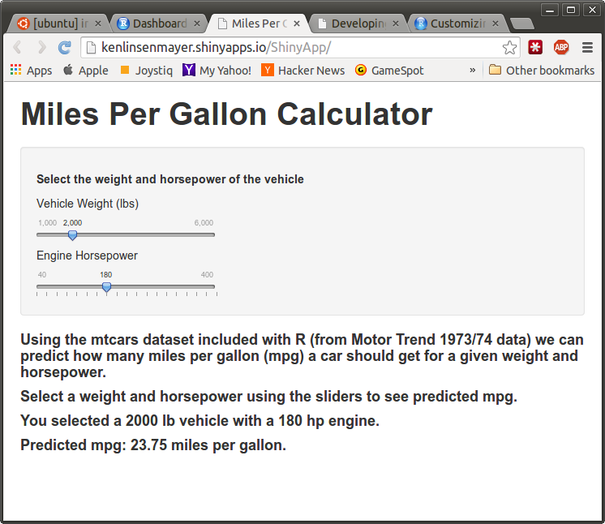

Classic 70's Automobile MPG predictor
========================================================
author: Ken Linsenmayer
date: Aug 22, 2014

Brief Overview
========================================================
If you are considering purchasing a sweet '70s car, you can't afford NOT to use our MPG predictor!  
  
We'll discuss:
- Why care about MPG?
- The prediction model
- MPG web app

Importance of MPG
====
MPG (miles per gallon) varies tremendously between vehicle types

```r
data(mtcars)
range(mtcars$mpg)
```

```
[1] 10.4 33.9
```
<small>As you can see below, if you drive 12,000 miles per year, assuming gas costs $3.50/gallon, driving a car that gets 30 MPG would save you $700 per year compared with a car that got 20 MPG.</small>

```r
(12000/20)*3.5 - (12000/30)*3.5
```

```
[1] 700
```


Our simple but effective model
========================================================
Our prediction model uses both the vehicle weight and horsepower to compute MPG.

```r
summary(lm(mpg~hp+wt,data=mtcars))$coef[,1:2]
```

```
            Estimate Std. Error
(Intercept) 37.22727    1.59879
hp          -0.03177    0.00903
wt          -3.87783    0.63273
```
Higher weight and higher horsepower will yield lower MPG.


MPG Web App
======================

- Fully Interactive
- Instant results
- Great teaching aid
- Save hundreds of $$$

***


